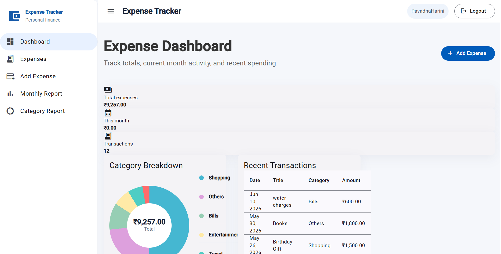
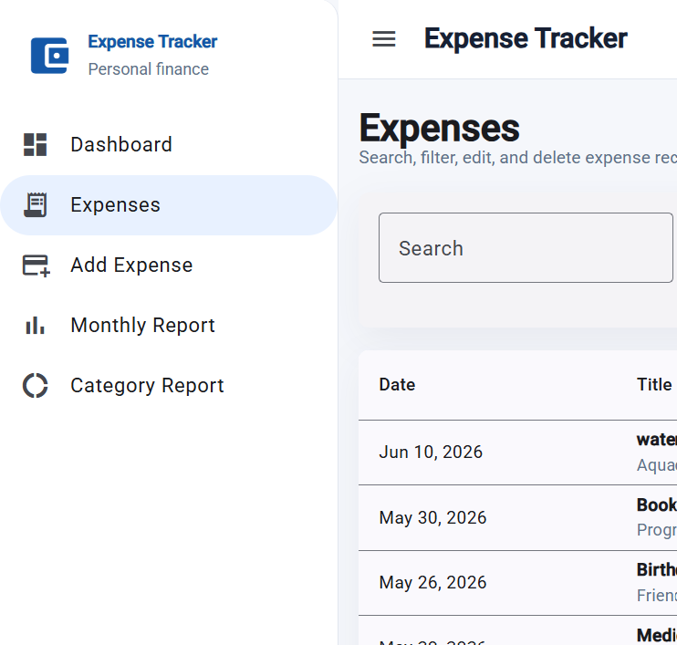
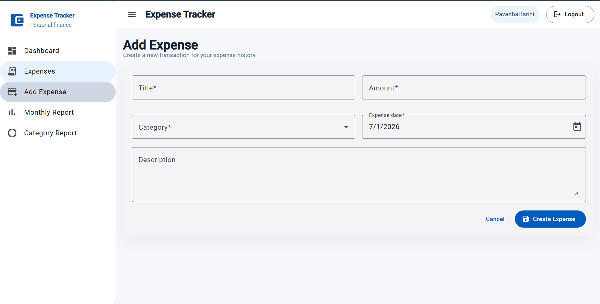
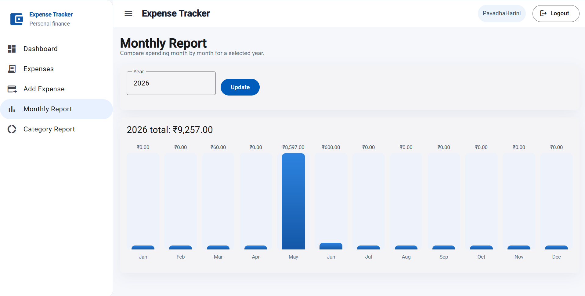
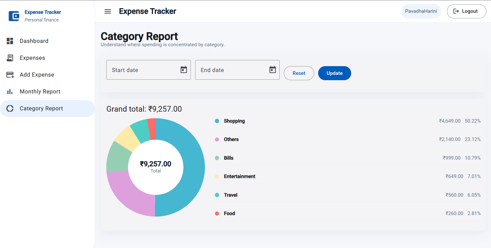

# 💰 Expense Tracker

A full-stack Expense Tracker application built using **Angular**, **Spring Boot**, and **PostgreSQL** that helps users manage their personal expenses efficiently.

---

## ✨ Features

- 🔐 User Authentication (Login & Registration)
- 💰 Add, Edit and Delete Expenses
- 📋 View All Expenses
- 🔍 Search and Filter Expenses
- 📊 Dashboard Overview
- 📈 Monthly Expense Report
- 🥧 Category-wise Expense Report
- 📱 Responsive User Interface

---

## 🛠️ Tech Stack

### Frontend

- Angular
- TypeScript
- Angular Material
- SCSS
- ApexCharts

### Backend

- Spring Boot
- Spring Security
- JWT Authentication
- REST APIs
- Maven

### Database

- PostgreSQL

### Tools

- Git
- GitHub
- Postman

---

## 🚀 Getting Started

### Clone the Repository

```bash
git clone https://github.com/Pavadhaharani/ExpenseTracker.git
```

### Backend

```bash
cd expense-tracker-backend
mvn spring-boot:run
```

### Frontend

```bash
cd expense-tracker-frontend
npm install
ng serve
```

Open your browser:

```
http://localhost:4200
```

---

## 📸 Application Screenshots

### Dashboard



---

### Expenses



---

### Add Expense



---

### Monthly Report



---

### Category Report



---

## 📂 Project Structure

```text
ExpenseTracker
├── expense-tracker-backend
├── expense-tracker-frontend
├── screenshots
└── README.md
```

---

## 🔮 Future Enhancements

- 🌙 Dark Mode
- 💵 Budget Planning
- 📄 Export Reports (PDF/Excel)
- 🤖 AI Expense Insights
- 📱 Mobile Application

---

## 👩‍💻 Author

**Pavadha Harini**

GitHub: https://github.com/Pavadhaharani

---

⭐ If you like this project, consider giving it a star!